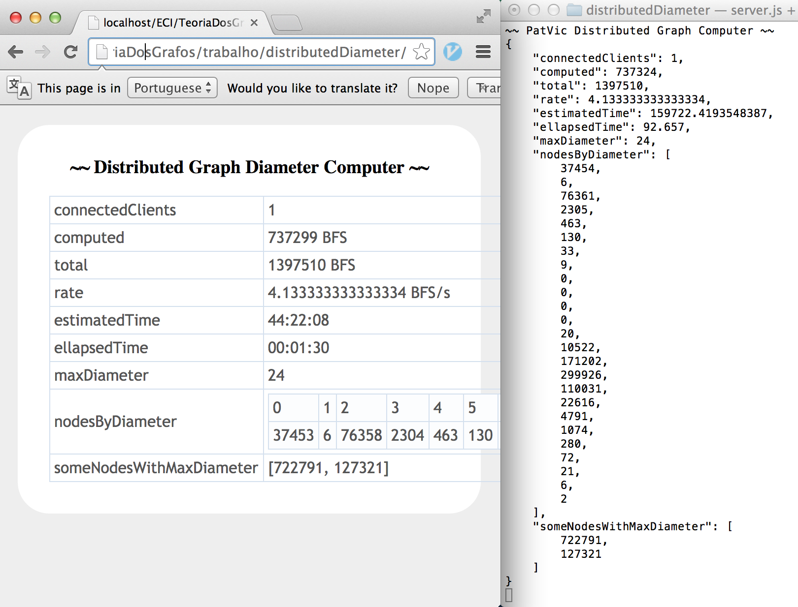

### Distributed Diameter Computing

This opens a distributed server for computing the diameter of a graph. To use it, just call:

    node server.js

Inside this folder. A node.js server will be opened. Then, access `index.html` (open it in a browser by clicking, or by serving it with apache, express.js, etc.). When you do, your browser will automatically start running part of the work necessary to compute the diameter of the graph.

